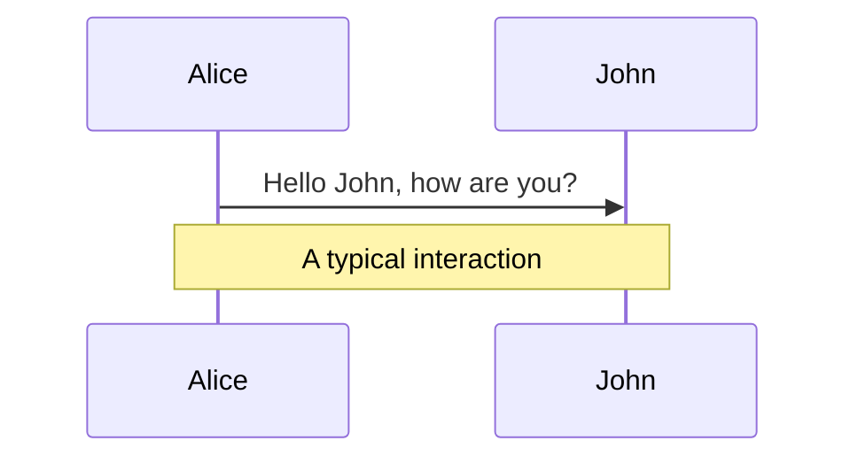

<head>
  <link rel="stylesheet" href="https://cdnjs.cloudflare.com/ajax/libs/animate.css/4.1.1/animate.min.css" />
</head>

<div class="absolute top-10">
  <span class="font-400">
    DengBowen 2024.8.13
  </span>
</div>

<div class="absolute bottom-10">
  <h1>Welcome to Slidev</h1>
  <p>this is my first slidev project</p>
</div>

<style>
h1{
   display: inline-block;
  margin: 1 0rem;

  animation: fadeInRight; /* referring directly to the animation's @keyframe declaration */
  animation-duration: 1s; /* don't forget to set a duration! */
  color: rgb(167, 223, 223);
}
</style>

---


# 代码

```ts {monaco}
console.log("Hello, world!");

```



<style>

</style>

---
layout: image-right
image: https://global.bing.com/th?id=OHR.JoshuaTreeNP_ZH-CN5917576674_1920x1080.jpg
---

# 组件 

<br/>

## 使用了一个自制的计数器组件

<Counter :count="10" />
<!-- ./components/Counter.vue -->

---
layout: fact
---

# 100%
Fact information

---
layout: iframe
url: https://www.bilibili.com/video/BV1oH4y1c7Kk/?spm_id_from=333.337.search-card.all.click
class: bilibili
---


---
layout: iframe-right

# the web page source
url: https://dengbowen666.github.io/MyVuePressWeb/

# a custom class name to the content
class: my-cool-content-on-the-left
---

*这是我的个人博客*


---
layout: end
---
# show end